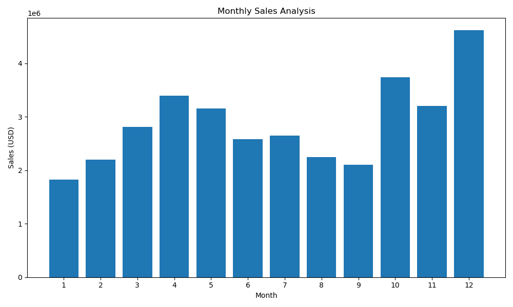
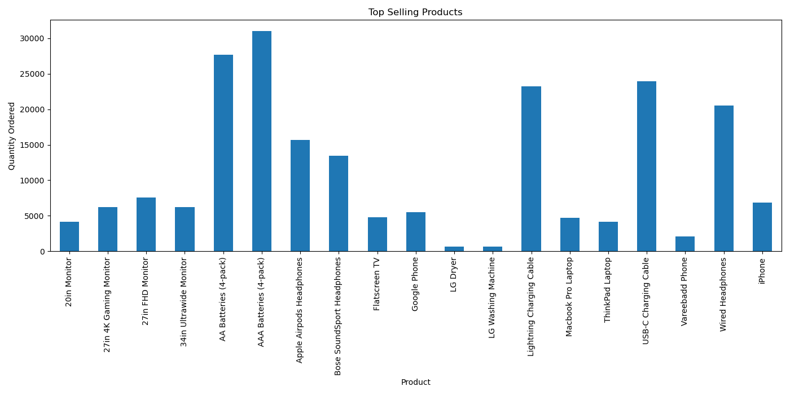
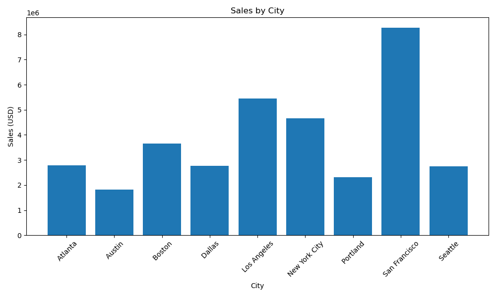
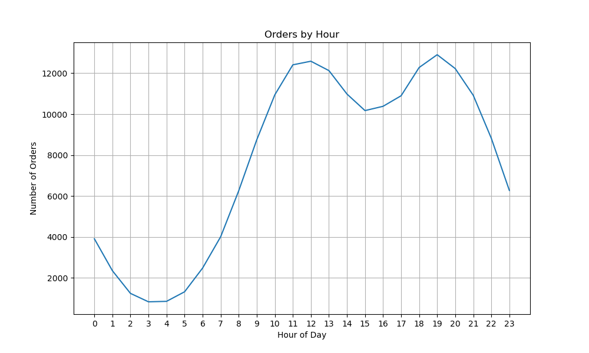

# Sales Data Analysis

## Project Overview

This project analyzes e-commerce sales data to uncover meaningful business insights such as monthly sales trends, top-selling products, city-wise sales performance, and customer purchasing behavior throughout the day.
The analysis demonstrates a typical **data analysis workflow** including data cleaning, feature engineering, exploratory data analysis (EDA), and visualization using Python.

---

## Objectives

The main objectives of this project are:

* Analyze monthly sales trends
* Identify the most popular products
* Determine which cities generate the highest revenue
* Understand customer purchasing patterns throughout the day
* Demonstrate practical data analysis using Python

---

## Technologies Used

* Python
* Pandas
* Matplotlib
* Jupyter Notebook
* Git & GitHub

---

## Dataset Description

The dataset contains sales records from an e-commerce store for multiple months of the year.

Each record includes:

| Column           | Description                      |
| ---------------- | -------------------------------- |
| Order ID         | Unique identifier for each order |
| Product          | Name of the purchased product    |
| Quantity Ordered | Number of items ordered          |
| Price Each       | Price of each product            |
| Order Date       | Date and time of purchase        |
| Purchase Address | Address of the customer          |

The monthly datasets were combined into a single dataset for analysis.

---

## Project Workflow

The project follows a typical **data science pipeline**:

1. Data Loading
2. Data Cleaning
3. Feature Engineering
4. Exploratory Data Analysis
5. Data Visualization
6. Business Insights

---

## Data Cleaning

The following preprocessing steps were performed:

* Removed rows containing missing values
* Removed incorrect header rows created while merging files
* Converted numeric columns to appropriate data types
* Converted the order date column to datetime format

These steps ensured the dataset was ready for analysis.

---

## Feature Engineering

New features were created to support deeper analysis:

* **Sales** → Quantity Ordered × Price Each
* **Month** → Extracted from Order Date
* **City** → Extracted from Purchase Address
* **Hour** → Extracted from Order Date timestamp

These features help analyze trends and customer behavior.

---

## Exploratory Data Analysis

The dataset was analyzed to answer several key business questions.

---

### 1. Monthly Sales Analysis

This analysis identifies how revenue varies across different months.

**Insight**

Sales increase significantly toward the end of the year, likely due to holiday shopping and seasonal demand.

---

### 2. Top Selling Products

This analysis determines which products are purchased most frequently.

**Insight**

Electronic accessories such as batteries and charging cables are among the most frequently purchased items.

---

### 3. Sales by City

This analysis shows which cities generate the highest revenue.

**Insight**

Major metropolitan cities generate significantly higher revenue compared to smaller cities.

---

### 4. Orders by Hour

This analysis examines the distribution of customer purchases throughout the day.

**Insight**

Sales activity peaks during midday and evening hours, suggesting optimal times for advertising and promotions.

---

## Project Structure

sales-data-analysis
│
├── data/ → Raw dataset files
├── notebooks/ → Jupyter notebook containing the analysis
├── images/ → Generated visualization images
└── README.md → Project documentation

---

## Key Learnings

Through this project, the following skills were developed:

* Data cleaning and preprocessing
* Feature engineering
* Data aggregation using Pandas
* Data visualization using Matplotlib
* Extracting business insights from data
* Structuring and documenting a data analysis project

---

## Dataset Size

Total Records: ~186,000  
Total Features: 6

---

## Business Insights

1. Sales peak during the holiday season, especially in December.
2. Everyday electronic accessories like batteries and charging cables dominate sales volume.
3. Major metropolitan cities contribute the highest revenue.
4. Customer purchasing activity peaks around midday and evening hours.

---

## Skills Demonstrated

- Data Cleaning
- Feature Engineering
- Exploratory Data Analysis
- Data Visualization
- Business Insight Generation

---

## Future Improvements

Possible future enhancements include:

* Building predictive models for sales forecasting
* Creating interactive dashboards
* Performing customer segmentation analysis
* Analyzing product correlation patterns

---

## Author

Urvashi Pandey
